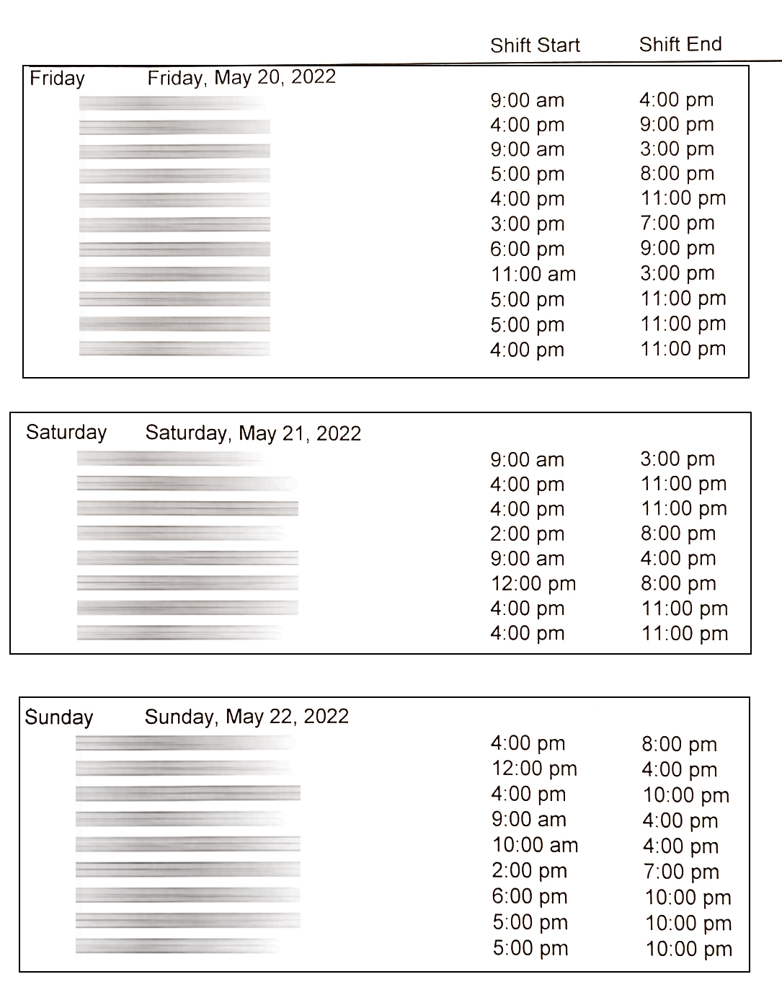
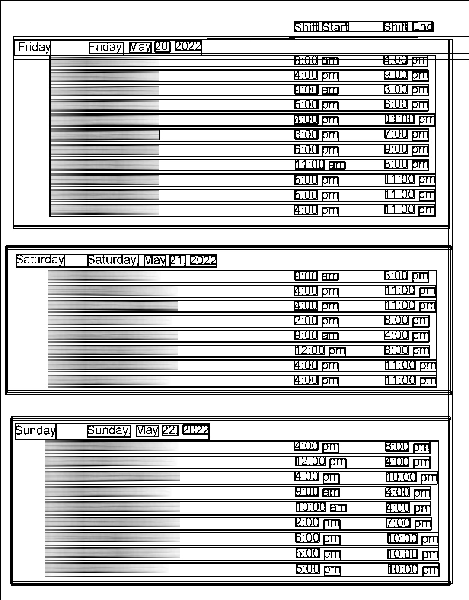

# ScheduleScanner

A python script that takes in many images of employee shift times and processes and formats the data and outputs an excel file.

Ideal image data will be straight on with no shadows. Here's an example of the schedule format

The program will output debug images of the opencv process to show the processed image as well as the ocr text recognition boxes if the image is not being read right.

